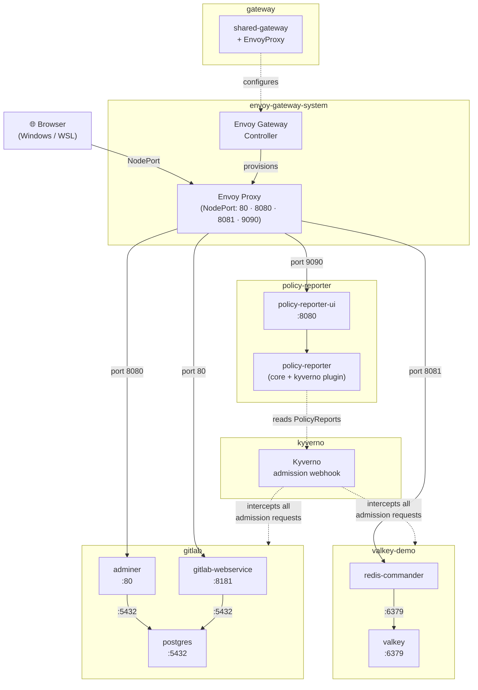

# K8S Lab

A local Kubernetes lab built on [k0s](https://k0sproject.io/) with [Envoy Gateway](https://gateway.envoyproxy.io/) for Gateway API support.

## Architecture



## Modules

| Module | Description |
|---|---|
| [Demo 1 — Valkey + Redis Commander](valkey-demo/README.md) | Valkey store + web UI exposed via Gateway API, with hand-crafted network policies |
| [Demo 2 — GitLab CE + PostgreSQL + Adminer](gitlab/README.md) | Full GitLab stack via Helm, with built-in network policies |
| [Lab — Kyverno policy enforcement](kyverno/README.md) | Validate, mutate and generate policies across the cluster |

---

## Step 1 — Install tooling

Install brew:
```bash
/bin/bash -c "$(curl -fsSL https://raw.githubusercontent.com/Homebrew/install/HEAD/install.sh)"
```

Install CLI tools:
```bash
brew install kubectl helm kyverno k9s
```

**`kubectl`** is the standard Kubernetes CLI — all commands in this lab use it.

**`k9s`** is a terminal UI that lets you navigate cluster resources interactively without typing long `kubectl` commands. Launch it with `k9s`, then use `:` to switch resource type (e.g. `:pods`, `:namespaces`), `/` to filter, `d` to describe, and `l` for logs.

---

## Step 2 — Bootstrap the cluster

### Install k0s

```bash
curl -sSf https://get.k0s.sh | sudo sh
sudo k0s install controller --single
sudo k0s start
```

Wait for the node to be ready (takes ~60 seconds):
```bash
sudo k0s kubectl get nodes
```

### Configure kubectl

```bash
mkdir -p ~/.kube
sudo k0s kubeconfig admin > ~/.kube/config
chmod 600 ~/.kube/config
kubectl get nodes
```

> **Behind a proxy?** Edit `~/.kube/config` and change the server IP to `localhost`.

### Install the local-path StorageClass

Required for any PersistentVolumeClaim (used by GitLab):
```bash
kubectl apply -f https://raw.githubusercontent.com/rancher/local-path-provisioner/v0.0.26/deploy/local-path-storage.yaml
kubectl patch storageclass local-path \
  -p '{"metadata":{"annotations":{"storageclass.kubernetes.io/is-default-class":"true"}}}'
```

### Install Envoy Gateway and the shared Gateway

```bash
helm install eg oci://docker.io/envoyproxy/gateway-helm \
  --version v1.7.1 \
  -n envoy-gateway-system \
  --create-namespace
kubectl apply -f cluster/
kubectl apply -f cluster/gateway/
```

The shared Gateway lives in the `gateway` namespace and exposes all lab services on a single NodePort service. Listeners:

| Listener | Port | Service |
|---|---|---|
| `gitlab` | 80 | GitLab web UI |
| `adminer` | 8080 | Adminer DB UI |
| `valkey` | 8081 | Redis Commander |
| `policy-reporter` | 9090 | Policy Reporter UI |

To find the NodePort assigned to each listener:
```bash
kubectl get svc -n envoy-gateway-system | grep shared-gateway
```

The `PORT(S)` column maps `<listener-port>:<nodeport>/TCP`. Access any service at `<node-ip>:<nodeport>`.

**To tear down the cluster entirely:**
```bash
sudo k0s stop
sudo k0s reset
```
